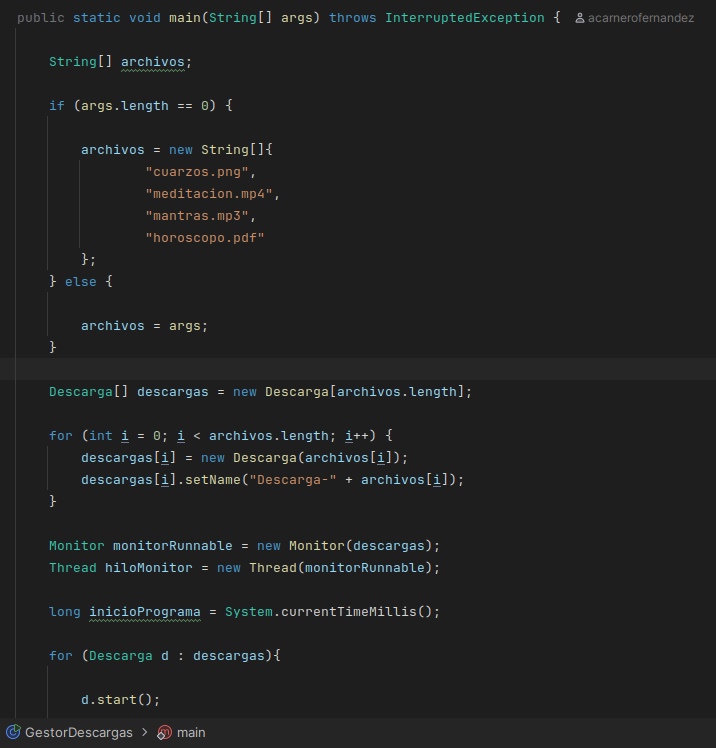
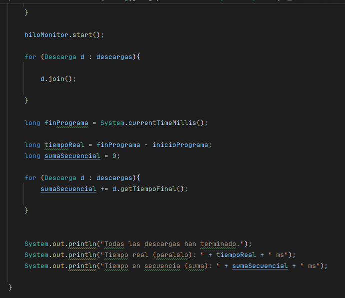
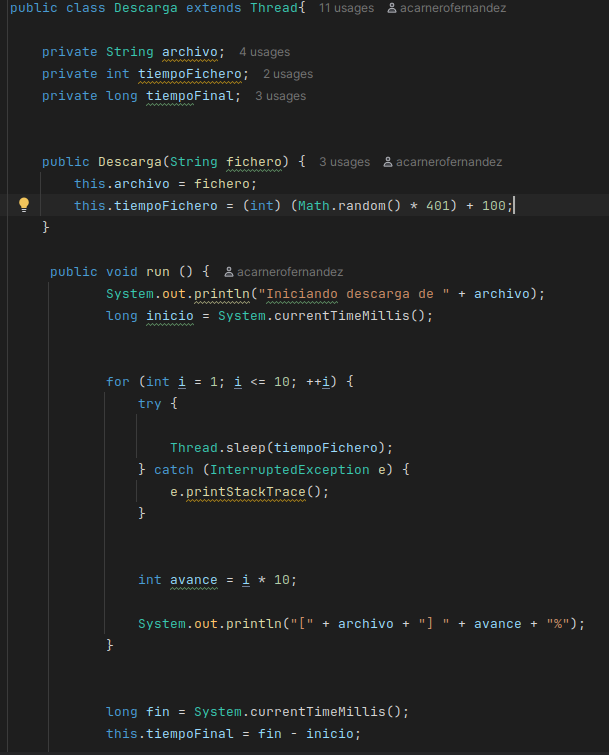
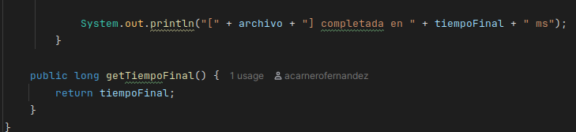
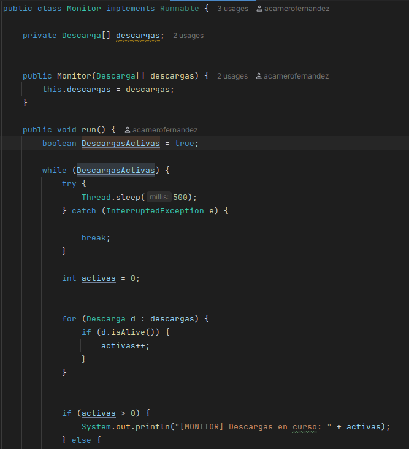
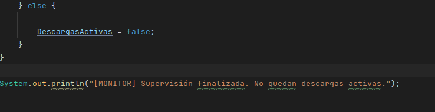

# Practica 01 Simulador de Descargas Multihilo en Java

## Estructura del Codigo

### Descarga.java
Clase que hereda de Thread para simular la descarga individual de un archivo en 10 bloques con pausas aleatorias de 100 a 500 ms por bloque.

### Monitor.java
Clase que implementa Runnable para revisar cada 500 ms cuantas descargas siguen activas con el metodo isAlive.

### GestorDescargas.java
Clase principal que lee los nombres de archivos desde la linea de comandos o usa los cuatro por defecto, inicia las descargas en paralelo con start y espera su finalizacion con join.

## Tabla de Pruebas de Ejecucion

Ejecutad el programa tres veces y completad la tabla con lo que os salga:

Ejecucion | Descarga mas lenta | Tiempo real (ms) | Suma (ms)
---|---|---|---|
1 | 3772 |3773 |12079 |
2 | 4822 | 4823 | 11558 |
3 | 1962| 1963|6440 |

## Preguntas e Informe Final

### Por que el tiempo real es mucho menor que la suma?

Porque los hilos se ejecutan al mismo tiempo de forma paralela. Las esperas ocurren en simultaneo y por eso el tiempo total del programa equivale al tiempo de la descarga mas lenta en lugar de la suma de todas.

### Que pasa si haceis start() y join() dentro del mismo bucle? Probadlo y poned el tiempo real que os sale.

Se hace de forma secuencial ya que hasta que no termine el primer hilo el join no permite volver a ejecutar el bucle.

Tiempo real obtenido al probar start() y join() en el mismo bucle: 11542 ms